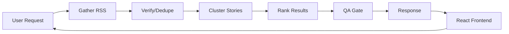

# News Agent Digest

A web application that creates personalized news digests from trusted RSS sources for information-seeking users using FastAPI (Python 3.12) and React 19 with TypeScript.

## Demo


## Features

### Implemented (v1.0)
- Multi-source verification with automatic story clustering
- Citation-backed reporting — every summary bullet links to original sources
- Trust-first design with domain allowlist for publishers
- QA gate validates all outputs before delivery
- RSS feed aggregation from configured sources
- Deduplication by canonical URL
- Topic-based filtering (tech, finance, health, daily, learning)
- Time-range filtering (24h, 3d, 7d)

### Planned (v2.0)
- LLM-powered summarization for richer story narratives
- Semantic clustering using embeddings (replacing Jaccard similarity)
- User preference learning and personalization
- Real-time push notifications for breaking stories
- Support for additional regions and custom RSS sources

## Architecture

The system uses a modular pipeline architecture. The backend fetches RSS feeds, validates and deduplicates articles, clusters related stories, ranks them by confidence, and returns citation-backed cards. The React frontend provides the user interface for requesting and displaying digests.



## Setup

### Prerequisites
- Python 3.12+
- Node.js 20+
- npm or yarn

### Quick Start

```bash
# Start both backend and frontend
./start.sh
```

Access points:
- Web App: http://localhost:5173
- API: http://localhost:8000
- API Docs: http://localhost:8000/docs
- Health Check: http://localhost:8000/health

### Run Tests

Backend:
```bash
cd backend
pytest
```

Frontend:
```bash
cd frontend
npm run lint
npm run typecheck
npm run build
```

### Configuration

RSS sources are configured in `backend/app/resources/sources.yaml`:

```yaml
regions:
  - region: canada
    publishers:
      - name: Publisher Name
        allowed_domains: ["example.com"]
        feeds:
          - name: Feed Name
            url: https://example.com/rss.xml
            topic: tech
```

Valid topics: `tech`, `finance`, `health`, `daily`, `learning`
Valid regions: `canada`, `usa`, `uk`, `china`, `global`

## API Reference

| Endpoint | Method | Description |
|----------|--------|-------------|
| `/digest` | POST | Generate a personalized news digest |
| `/health` | GET | Health check endpoint |

### Example Request

```json
POST /digest
{
  "topics": ["tech", "finance"],
  "range": "24h",
  "regions": ["canada", "usa"],
  "max_cards": 12,
  "max_cards_per_topic": 5
}
```

### Example Response

```json
{
  "schema_version": "v1",
  "generated_at": "2024-01-15T10:30:00Z",
  "qa_status": "pass",
  "request": { "topics": ["tech"], "range": "24h", "regions": ["canada"] },
  "cards": [{
    "id": "abc123",
    "topic": "tech",
    "headline": "Story headline",
    "publisher": "Publisher Name",
    "published_at": "2024-01-15T08:00:00Z",
    "confidence": "multi_source",
    "bullets": [{
      "text": "Summary bullet",
      "citations": [{"publisher": "Source", "url": "...", "published_at": "..."}]
    }],
    "sources": []
  }],
  "qa_notes": []
}
```

## Data Model / Schema

**DigestRequest**
| Field | Type | Description |
|-------|------|-------------|
| topics | `Topic[]` | Topics to include |
| range | `TimeRange` | Time window (24h, 3d, 7d) |
| regions | `Region[]` | Regions to source from |
| max_cards | `int` | Total card limit |
| max_cards_per_topic | `int` | Per-topic limit |

**StoryCard**
| Field | Type | Description |
|-------|------|-------------|
| id | `str` | Unique identifier |
| topic | `Topic` | Assigned topic |
| headline | `str` | Story headline |
| publisher | `str` | Primary publisher |
| published_at | `datetime` | Publication timestamp |
| confidence | `ConfidenceLevel` | single_source or multi_source |
| bullets | `BulletPoint[]` | Summary with citations |
| sources | `Citation[]` | All source citations |

## Trade-offs & Design Decisions

- **Chose:** RSS feeds over news APIs
- **Gave up:** Broader source coverage, real-time updates, rich metadata
- **Why:** RSS is free, requires no API keys, and avoids rate limits; keeps the system simple and self-hostable without external dependencies

- **Chose:** Jaccard similarity for story clustering
- **Gave up:** Semantic similarity via embeddings
- **Why:** Jaccard is fast, deterministic, and requires no ML dependencies; suitable for MVP with title-based clustering

- **Chose:** Domain allowlist for source trust
- **Gave up:** Automated credibility scoring
- **Why:** Explicit allowlist is transparent, auditable, and prevents adversarial sources; aligns with trust-first design principle

## Limitations

- Only supports RSS feeds from pre-configured domain allowlist
- No real-time updates — digests are generated on-demand
- Story clustering relies on title similarity only (no content analysis)
- No user authentication or persistent preferences
- Limited to 5 regions and 5 topics in current configuration
- Citation granularity is at the story level, not individual claims

## Next Steps

- Integrate LLM for enhanced summarization and bullet generation
- Replace Jaccard clustering with embedding-based semantic similarity
- Add user accounts with saved preferences and digest history
- Implement WebSocket support for real-time digest updates
- Expand source registry with automated feed discovery
- Add content-based deduplication beyond URL canonicalization
